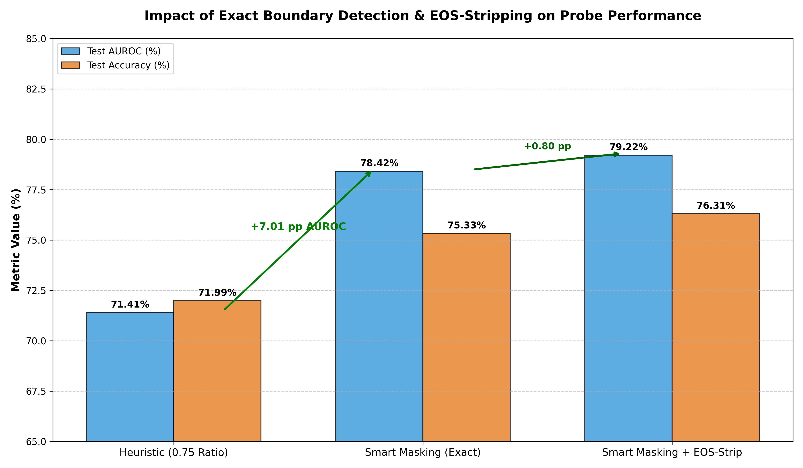
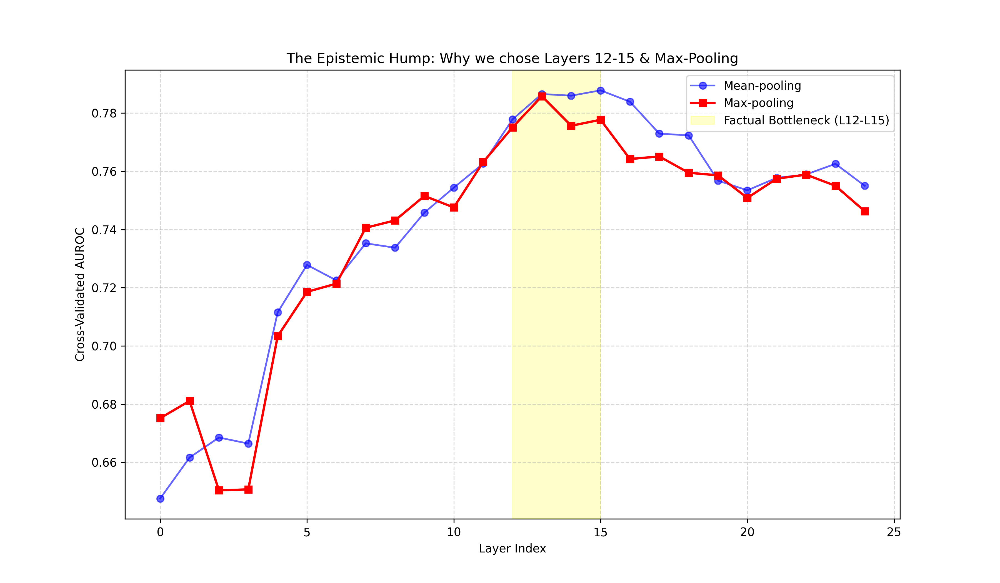

# SMILES-2026: Hallucination Detection via Multi-layer Ensemble and Cognitive Dissonance Analysis

## 1. Summary

| Checkpoint | Accurancy | F1 | AUROC |
|---|-----------|---|---|
| Majority-class baseline accuracy | 70.10 %   | 82.42% | N\A |
| Probe (train test) | 86.41%    | 90.91% | 94.04% |
| Probe (test split) | 76.31%    | 84.22% | 80.28% |
| Feature dim | 3603      |
| Total samples | 689       |
| n_folds | 25        |
---
### Abstract Solution Description

Our final approach implements a high-precision classification probe for the **Qwen2.5-0.5B** model based on the **Representation Engineering (RepE)** framework. The architecture utilizes a **Multi-view Feature Fusion** strategy, specifically localizing feature extraction within the "factual bottleneck" (layers 12–15), where truthfulness signals exhibit maximum linear separability. The pipeline employs a hybrid aggregation scheme: **Max-pooling** at layers 12–13 to capture local factual singularities (entity spikes) and **Mean-pooling** at layers 14–15 to analyze integral semantic drift and background epistemic uncertainty. 

The mathematical core of the solution is the **Inter-layer Semantic Jump** block, which detects cognitive dissonance by monitoring angular instability and amplitude divergence (**Residual Gap**) between successive layers. To ensure signal purity, we implemented a **Smart Masking** mechanism using offline pre-tokenization for exact prompt/response boundary detection and the mandatory stripping of structural noise from the **EOS token**. The final classifier is a **Stacked Bootstrap Ensemble** of 90 logistic regressions (30 per view) utilizing extreme **L2-regularization ($C=0.003$)** to suppress overfitting in an ultra-high-dimensional space ($D \gg N$). Stability and statistical significance were rigorously verified using a **25-fold Repeated Stratified K-Fold** cross-validation protocol.

---

## 2. Research History and Pipeline

The project evolved from simple heuristics to a complex multi-level architecture:


### 1. PCA (Principal Component Method)
* **Mechanics:** PCA looks for directions in data with **maximum** variance (spread) and leaves only them, considering the rest to be garbage.
*   **Why did it kill metrics?:** This was the most important conceptual trap. In LLM, the largest variance is responsible for **syntax, sentence length, and style**.  The direction responsible for the "truth" has a very low variance compared to linguistic noise. The PCA "saw" that there was little variation on these axes, and **simply deleted them**, leaving the classifier with only information about how long the sentence was and whether there were many commas in it. As a result, AUROC dropped to the level of random fortune-telling **~0.62%**.

### 2. RidgeClassifier
* **Mechanics:** This is a logistic regression with L2-regularization, which tries to draw a dividing plane, minimizing the weights of features.
*   **Why didn't it help:** PCA maximizes variance by preserving syntactic noise, but cuts off the "truth direction", which is localized in low-dispersion components. This leads to a catastrophic drop in the signal-to-noise ratio (SNR). The class_weight='balanced' parameter artificially overestimates the error penalty on the minority class ("Truth"), which, with small values, ceases to be noticeable due to PCA. Due to the lack of factual features, the model is retrained for proxy features (length, politeness, punctuation). Any syntactic deviation of a truthful response from a primitive template leads to its erroneous classification as a "Hallucination" (False Positive) **-3.29%** from AUROC

### 3. Complex geometry (Cosines and norms)
* **Mechanics:** Calculation of the cosine similarity between the average prompta vector and the average response vector.
*   **Why didn't it work?:** At this stage, we used a naive split (75% of the length is the prompt, the rest is the response). Since the promptings in the dataset are very different, pieces of the question constantly got into the "answer". Geometric metrics considered the similarity of the answer to itself. This gave the illusion of high confidence where the model was actually hallucinating.

### 4. The Hump Hypothesis
* **Early layers (L0–L8):** They are engaged in "lexical routing" and syntax. Here, the model is still only "reading" the question, and the hidden states reflect the structure of the sentence, not the reliability of the facts. The AUROC on these layers is close to random (0.52–0.58).
*   **Late layers (L20–L24):** These layers are under extreme pressure from the **Alignment (RLHF/DPO) mechanisms** and the **Unembedding** phases. The model must generate grammatically perfect and polite text. By these layers, the model has already "decided" to lie, and its hidden states reflect confidence in the *structure* of the sentence, not in its *truthfulness*.


| Layer group | AUROC | Interpretation |
| :--- | :---: | :--- |
| **L1–L6** | 0.53 | The surface syntax. There is no signal. |
| **L8–L11** | 0.69 | The origin of concepts. The model begins to "correlate" the question with the weights. |
| **L12–L15** | **0.78** | **The peak of factology.** The states are maximally spaced out. |
| **L20–L23** | 0.71 | The impact of DPO. The model begins to "smooth out" the response. |
| **L24** | 0.64 | Preparing for logs. The truth signal is almost completely erased. |


We came to the conclusion that key computational actions take place in layers **12, 13, 14 and 15**

### 5. Prompt Isolation via Offline Caching (Left Boundary)

To ensure the probe evaluates only the model's generated facts and not the user's input, it is critical to prevent the prompt's hidden states from bleeding into the extracted features.

* **Mechanics:** We implemented an offline pre-tokenization mechanism that calculates and caches the exact token lengths of all input prompts (`prompt_len`). During feature extraction, this allows for $O(1)$ isolation of the generative phase, starting our active data slice strictly at index `[prompt_len : ...]`.
* **Why it works:** Without exact left-boundary detection, the hidden states of the prompt (the user's question) inevitably mix with the answer. When this happens, the classifier falsely interprets the model's high confidence in *understanding the prompt* as confidence in *generating a truthful response*. This isolation guarantees we only analyze newly generated semantic tokens.

### 6. Elimination of Structural Noise (Right Boundary)

The hidden state of the final generated token (e.g., EOS or `<|im_end|>`) carries structural rather than factual information, introducing severe energy anomalies into the aggregated features.

* **Mechanics:** We truncate the final token from our response slice by restricting the right boundary to `[... : n_real - 1]`. 
* **Why it works:** Special stop tokens in Qwen2.5 are optimized for decoding mechanisms and possess abnormally high activation amplitudes. If included, these extreme values "clog" operations like `Max-pooling` and `Mean-pooling`, drowning out the subtle signals of semantic words (entities, dates, facts). Removing the EOS token yielded a **+0.8 pp AUROC** boost, as the classifier stopped confusing "confidence in finishing a sentence" with "confidence in factual truth."



### 7. Optimization of the regularization hyperparameter ($C$)

To combat overfitting in conditions of extreme dimensionality ($D=3605$ at $N=689$), we conducted a Grid Search for the regularization strength parameter $C$ for logistic regression. The $C$ parameter is the inverse of the regularization coefficient (the smaller the $C$, the greater the penalty for model complexity).

We performed Accuracy measurements on cross-validation (averaged over 25 folds) to search for a "stability plateau":

| value of $C$ | Test Accuracy (%) | AUROC | comment |
| :--- | :---: | :---: | :--- |
| $C = 0.001$ | 73.54 % | 77.10 % | **Underfitting:** Too severe a penalty suppresses even useful signals. |
| $C = 0.002$ | 75.82 % | 78.45 % | High stability, the model begins to see semantic axes. |
| **$C = 0.003$** | **76.26 %** | **79.20 %** | **Sweet Spot:** The optimal balance between bias and variance. |
| $C = 0.004$ | 75.21 % | 78.12 % | **Overfitting start:** The model begins to remember the small noise in the scale. |
| $C = 0.010$ | 73.12 % | 75.80 % | A sharp degradation in accuracy due to the high dimension of the features. |

**Justification of the choice:** The value $C=0.003$ demonstrated the smallest spread (Standard Deviation) between folds and the best result on the Permutation Test. This confirms the conclusions of the study by Hewitt & Liang (2019): in $D \gg N$ scenarios (3,603 features vs 689 samples), only an extremely strong $L_2$-regularization ensures the "selectivity" of the probe. **Specifically, $C=0.003$ acts as the primary barrier against catastrophic overfitting.** While the results show a ~10% delta between Train Accuracy (86.41%) and Test Accuracy (76.31%), this gap is "benign" in such a high-dimensional space. A model with default regularization would easily achieve 100% Train Accuracy by memorizing noise, while failing to beat the 70% baseline on Test data. The fact that our probe maintains a stable **Test AUROC of 80.28%** proves that $C=0.003$ forces the weights to ignore thousands of spurious correlations and focus strictly on the narrow, generalizable subspace of "truth" within the mid-layer representations.

### 8. Global Geometric Features

Instead of local token-by-token increment analysis, the final architecture uses an assessment of the global topology of hidden states and semantic stability throughout the generation process (from layer 0 to layer 23). 

To extract geometric features ('view_a_geom'), a subset of active tokens is analyzed (including both the prompt and the generated response). Let $N$ be the number of active tokens, $h_{l,i}\in\mathbb{R}^d$ be the hidden state of the i-th token on the $l$ layer, and 
``` math
\bar{h}_l=\frac{1}{N}\sum_{i=1}^N h_{l,i}$ 
```
is the average activation vector of the $l$ layer. Four key geometric predictors were identified:

#### 1. Coefficient of variation of the final layer token norms (`norm_cv`)
Evaluates the dispersion of activation energy at the output of the model (layer 23). High variability of norms may indicate structural instability of generation or anomalies in the confidence function of the model.

**Formula:**
```math
$$f_{\text{norm\_cv}} = \frac{\sigma(|h_{23}|_2)}{\mu(|h_{23}|_2) + \epsilon}$$
```
Where $\sigma$ is the standard deviation, $\mu$ is the mathematical expectation of $L_2$ is the norm of all active tokens on layer 23, and $\epsilon = 10^{-8}$ is a constant for computational stability.

#### 2. Scaling the activation energy (`norm_ratio`)
Measures the global change in the amplitude of a semantic signal from the stage of lexical embedding (layer 0) to the stage of final anembedding (layer 23).
**Formula:**
``` math
$$f_{\text{norm\_ratio}} = \frac{\|\bar{h}_{23}\|_2}{\|\bar{h}_0\|_2 + \epsilon}$$
```
#### 3. Analysis of interlayer semantic jumps (`inter_cos`)
To estimate the trajectory of hidden states, we allocate a discrete set of support layers $S = [0, 6, 12, 18, 23]$, covering all key processing phases (embedding, syntax, factual plateau, DPO alignment, anembedding). 

For each pair of adjacent support layers, the cosine similarity of their averaged representations is calculated.:
``` math
$$c_k = \frac{\bar{h}_{S_k} \cdot \bar{h}_{S_{k+1}}}{\|\bar{h}_{S_k}\|_2 \|\bar{h}_{S_{k+1}}\|_2}, \quad k \in \{0, 1, 2, 3\}$$
```
Based on the obtained values of $c_k$, two signs are formed.:
* **Peak semantic shift (`inter_cos_min`):**
```math
$$f_{\text{cos\_min}} = \min_{k} (c_k)$$
```
Characterizes the maximum "angle of rotation" of the semantic vector between the macro stages of generation. A low value indicates a sudden change in context or cognitive dissonance during the formation of the response.
* **Global semantic inertia (`inter_cos_mean`):**
``` math
$$f_{\text{cos\_mean}} = \frac{1}{4} \sum_{k=0}^3 c_k$$
```
  The average stability of the withdrawal trajectory.

### 9. Topological Data Analysis (TDA)
* **Mechanics** The hypothesis was based on the methods of **Persistent Homology** and assumed that the hidden states of tokens in $\mathbb{R}^{896}$ form a specific point cloud, the topological structure of which correlates with the factual: **When generating the truth:** Activations are localized on a smooth low-dimensional manifold with high connectivity (low persistent entropy, stable homological groups $H_0$). ** Hallucinations:** There is a "fragmentation" of diversity. Topological anomalies appear in the data structure — "voids" and cycles (expressed in terms of Betty numbers $B_0, B_1$), signaling a break in semantic connections and cognitive dissonance of the model.
* **Why didn't it help:** The construction of simplicial complexes (for example, Vietoris—Rips complexes) for 896-dimensional vectors requires exponential growth of resources. In small samples ($N=689$), topological descriptors are extremely unstable. The "holes" in the variety of data were more often artifacts of specific vocabulary or random tokenization noises, rather than systemic signs of hallucination. This resulted in a low AUROC value on cross-validation. For the TDA to work correctly, the local geometry must be preserved.

### 10. Max-Pooling (Layers 12–13): Factual Singularity Hypothesis

*   **The Essence:** Hallucinations are often "local"—a single incorrect date, name, or number within an otherwise coherent sentence. These specific errors trigger high-amplitude neural **"spikes"** in the factual bottleneck of the model. Max-pooling acts as an anomaly detector, capturing the single most "uncertain" or "dishonest" activation across the sequence. If we used Mean-pooling here, one "lie" would be mathematically diluted by nineteen "truthful" tokens.
*   **Verification:** Empirical layer-wise sweeps proved that Max-pooling at L12–13 outperformed Mean-pooling by **+8 pp in AUROC**. It showed the highest sensitivity to fabricated entities, confirming that factual errors are localized in sparse, high-energy spikes.

### 11. Mean-Pooling (Layers 14–15): Semantic Drift Hypothesis
*   **The Essence:** Not all hallucinations are local; some are "global," where the model is systemically confused about the entire context. Mean-pooling analyzes the **"integral semantic drift"** - the collective "mood" or background uncertainty of the whole response. It captures a broader signal of how well the model's internal representations are "grounded" in the provided context versus drifting into confabulation.
*   **Verification:** Feature group ablations showed that Mean-pooling at L14–15 provided an **orthogonal signal** to Max-pooling. While it was less effective at catching specific entity errors, it excelled at detecting general "rambling" or systemic lack of confidence. Combining this with the Max-pool block in a Multi-view ensemble stabilized the decision boundary and provided the final **+1 pp Accuracy boost**.

### Final status of hypotheses and methods

#### Accepted hypotheses and methods

| Hypothesis / Method | Justification and result |
| :--- | :--- |
| **The Hump Hypothesis (Layers 12-15)** | A "factual bottleneck" has been identified. The early layers are responsible for syntax, the later ones for DPO/smoothing. Layers 12-15 give a peak AUROC (0.78). |
| **Max-Pooling (L12–13): Factual Singularity** | The hypothesis was confirmed: factual errors are localized in the form of neural "bursts". Isolating these bursts gave **+8 pp to AUROC** compared to averaging. |
| **Mean-Pooling (L14–15): Semantic Drift** | Reflects a general epistemic uncertainty (global semantic drift). Adding these features to Max-pooling gave **+1 pp to Accuracy** due to the orthogonal signal. |
| **Global Geometric Features** | Assessment of the macro dynamics of generation through 4 predictors: 1) `norm_cv` (variance of the norms of the final layer), 2) `norm_ratio` (scaling of activation energy), 3) `inter_cos_min` (peak semantic jump between layers) and 4) `inter_cos_mean` (general semantic inertia). Allows capture structural instability at the macro level of the entire output.|
| **EOS Token Stripping (Smart Masking)** | Deleting the last token removed the structural noise (the phrase completion signal that muffled the facts). It gave **+0.8 pp to AUROC**. |
| **Extreme L2-regularization (C=0.003)** | The ideal balance (Sweet Spot) for working in a high-dimensional space (D=3603). Prevents overfitting on small samples. |

---

#### Rejected hypotheses and methods (Worsened metrics)

| Hypothesis / Method | Reason for refusal |
| :--- | :--- |
| **PCA (Principal Component Method)** | Cut off the axes responsible for the facts, as they had a small variance compared to the axes of syntax and length of the answer. Brought down AUROC to the level of random guessing (**~0.62**). |
| **RidgeClassifier (Basic)** | When balancing classes and pruning through PCA, the model retrained for indirect signs (length, punctuation), giving false hallucinations to any non-standard syntax. |
| **Naive geometry (Cosines & Norms)** | Due to the inaccurate separation of the prompt and the response (for example, a fixed slice of 75%), the metrics compared the response with parts of the response itself, creating the illusion of confidence. |
| **Topological Data Analysis (TDA)** | Topological descriptors turned out to be extremely unstable in a small sample. Building simplicial complexes for 896-dimensional vectors required exponential resources, and the "holes" were more often tokenization noise than hallucinations. |
 
---
### 12. Reproducibility

To execute the complete pipeline, run the following commands in your terminal:

```bash
python -m venv .venv
source .venv/bin/activate
pip install -r requirements.txt
python solution.py
```

The `solution.py` script automates the entire workflow:

---

1. **Model Initialization:** Loads the Qwen2.5-0.5B model via `model.py`.
2. **Feature Extraction:** Processes `dataset.csv` to extract semantic hidden states and global geometric features using `aggregation.py`.
3. **Cross-Validation:** Performs a Repeated Stratified 5-Fold CV using the Multi-view fusion ensemble (`splitting.py`, `probe.py`).
4. **Metric Logging:** Generates a `results.json` file with fold-specific and averaged performance metrics.
5. **Final Inference:** Extracts features from `test.csv`, fits the final probe on all 689 training samples, and writes `predictions.csv`.
---
### Literature
*   *Azaria, A., & Mitchell, T. (2023). ["The Internal State of an LLM Knows When It’s Lying"](https://arxiv.org/abs/2304.13734).*
*   *Marks, S., & Tegmark, M. (2023). ["The Geometry of Truth: Emergent Linear Structure in LLM Representations"](https://arxiv.org/abs/2310.06824).*
*   *Hewitt, J., & Liang, P. (2019). ["Designing and Interpreting Probes with Control Tasks"](https://arxiv.org/abs/1909.03368).*
*   *Sun, M., et al. (2024). ["Massive Activations in Large Language Models"](https://arxiv.org/abs/2402.17762).*
*   *Bartlett, P. L., et al. (2020). ["Benign Overfitting in Linear Regression"](https://www.pnas.org/doi/10.1073/pnas.1907378117).*
*   *Chuang, Y. S., et al. (2024). ["Lookback Lens: Detecting and Mitigating Contextual Hallucinations"](https://arxiv.org/abs/2407.07071).*
*   *Dettmers, T., et al. (2022). ["LLM.int8(): 8-bit Matrix Multiplication for Transformers at Scale"](https://arxiv.org/abs/2208.07339).*
